# 📨 Mensageria

**Mensageria** é um modelo de comunicação entre sistemas onde eles **não falam diretamente entre si**, mas trocam mensagens através de um intermediário (Message Broker).

## 🏛️ 4 Pilares:

- **Message/Event:** Payload da Mensagem de algo que já aconteceu.
- **Message Broker:** Servidor de Mensagens (Intermediador)
- **Producer/Subscriber:** Quem envia o evento
- **Consumer/Subscriber:** Quem consome e processa o evento

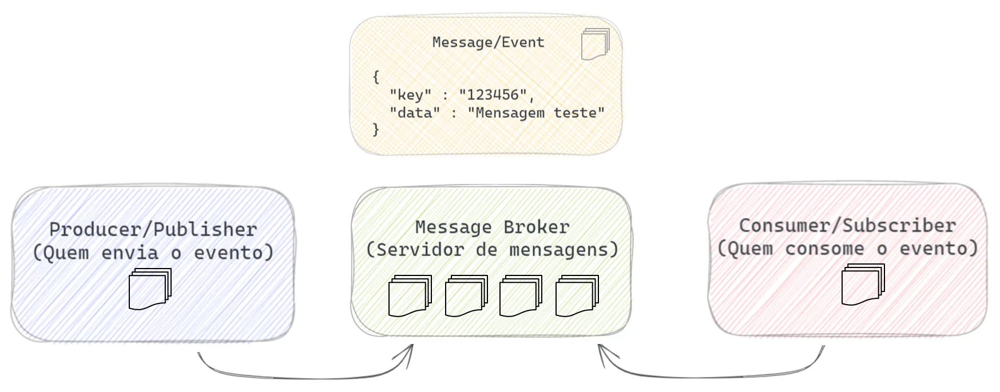

### 💬 1. Message / Event (Mensagem / Evento)

É a **unidade básica de comunicação**, contem o payload da mensagem.

#### 📌 O que é:
- Um dado que representa algo que aconteceu
- Pode ser:
    - um comando (“crie pedido”)
    - um evento (“pedido criado”)

#### 🎯 Papel:
- Transportar informação entre sistemas
- Representar mudanças de estado

#### 🧠 Diferença importante:
- **Message (mensagem) →** intenção (faça algo)
- **Event (evento) →** fato ocorrido (algo já aconteceu)

👉 Exemplo:
```json
{
  "pedidoId": 123,
  "status": "CRIADO"
}
```

### 📬 2. Message Broker
É o **intermediário**, o coração da mensageria.

#### 📌 O que é:
Um sistema que recebe, armazena e distribui mensagens

#### Exemplos:
- Apache Kafka
- RabbitMQ

#### 🎯 Papel:
- Desacoplar produtores e consumidores
- Garantir entrega de mensagens
- Gerenciar filas/tópicos
- Controlar escalabilidade

#### 🔴 Sem broker:
- Sistemas ficam acoplados
- Falhas propagam facilmente

#### 🟢 Com broker:
- Cada sistema evolui independente

### 📤 3. Producer / Publisher
É quem **envia a mensagem**.

#### 📌 O que é:
- Serviço que gera eventos ou mensagens
- Não sabe quem vai consumir

#### 🎯 Papel:
- Publicar dados no broker
- Iniciar o fluxo de comunicação

#### 🧠 Característica importante:
- Baixo acoplamento
- Producer não conhece consumers
- Só conhece o destino (topic/fila)

#### 💡 Exemplo:
- Sistema de pedidos publica:
    - “pedido criado”

### 📥 4. Consumer / Subscriber
É quem **recebe e processa a mensagem**.

#### 📌 O que é:
- Serviço que escuta eventos/mensagens

#### 🎯 Papel
- Consumir dados
- Executar lógica de negócio
- Reagir a eventos

#### 🧠 Característica importante:
- Pode haver vários consumidores para a mesma mensagem
- Cada um com responsabilidade diferente

#### 💡 Exemplo:

Após “pedido criado”:
- **Serviço de pagamento →** processa pagamento
- **Serviço de estoque →** baixa estoque
- **Serviço de email →** envia confirmação

### ⚖️ Analogia simples (correios 📦)
- **Message/Event →** a carta
- **Producer →** quem envia
- **Broker →** os correios
- **Consumer →** quem recebe

## 💡 Mensageria resolve qual problema?

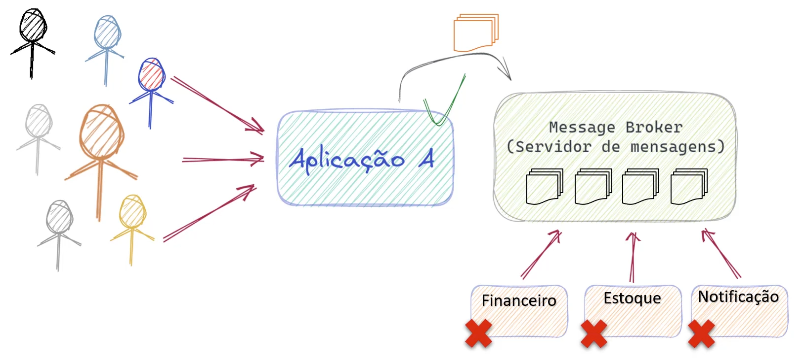

#### ✅ Desacoplamento
- Sistemas não dependem diretamente uns dos outros
#### ✅ Escalabilidade
- Você escala consumidores conforme carga
#### ✅ Resiliência
- Se um consumer cair, mensagem continua no broker
#### ✅ Flexibilidade
- Novos consumidores podem ser adicionados sem impactar produtores

### 🧾 Exemplo simples:
- Aplicação A gera um pedido
- Em vez de chamar diretamente o sistema B, ele envia uma mensagem
- O sistema B processa quando puder


# ⬛ Apache kafka

Originalmente **Apache Kafka** nasceu dentro do **LinkedIn**, com o objetivo de resolver problemas internos da empresa para tornar a comunicação entre as aplicações mais eficiente, o Apache Kafka é uma **plataforma de código aberto de processamento de streams** em Java e Scala.

Um dos principais objetivos do **Apache Kafka** é fornecer a capacidade de **lidar com grande volume de eventos** e **baixa latência**.

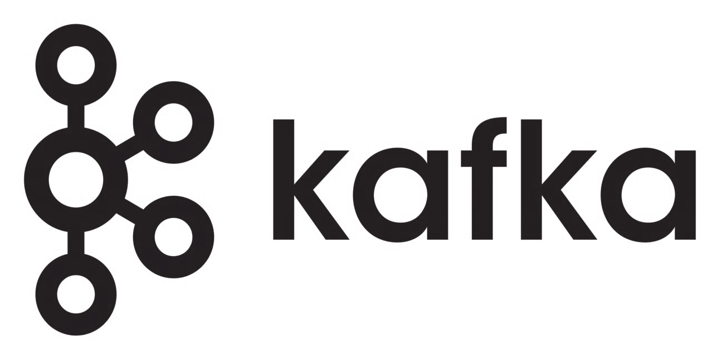

Os **engenheiros do LinkedIn** precisavam melhorar sua infraestrutura para atender o crescimento do ecossistema, dado que a rede estava crescendo e ganhando espaço na internet.

Em **2011** o projeto torna-se open-source com o guarda chuva da **Apache**, em **2014** os criadores do **Apache Kafka** criam a renomada empresa chamada **Confluent**.


## 🏗️ Arquitetura
O Kafka funciona como um **log distribuído**.

👉 Em vez de “fila que consome e apaga”, ele mantém um histórico de eventos.

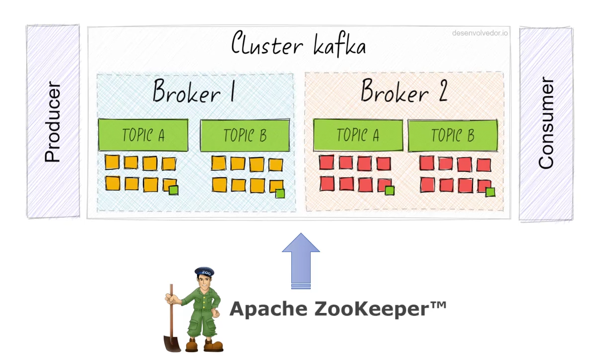

### 🔄 Como o Kafka funciona (fluxo)
1. Producer envia mensagem para um tópico
1. Kafka grava em uma partição
1. Mensagem fica armazenada (não some)
1. Consumer lê na velocidade dele
1. Offset controla o progresso

### 🧩 Principais componentes

| Conceito       | Descrição                                  |
| -------------- | ------------------------------------------ |
| Topic          | Canal lógico onde mensagens são publicadas |
| Producer       | Responsável por enviar mensagens           |
| Consumer       | Responsável por consumir mensagens         |
| Partition      | Divisão interna de um tópico               |
| Consumer Group | Grupo de consumidores compartilhando carga |
| Offset         | Identificador da posição da mensagem       |

### 1️⃣ Producer (Produtor)

O **produtor** é o componente responsável por se comunicar com o **cluster do Apache Kafka** e **publicar mensagens em um tópico**. Ele decide para qual tópico enviar e, em muitos casos, também define a chave da mensagem, que influencia em qual partição ela será gravada.

Por padrão, o Kafka mantém essas mensagens armazenadas por um período **(geralmente 7 dias)**, mas isso é totalmente configurável. Após esse tempo, os dados são removidos seguindo a ordem em que foram persistidos, respeitando o modelo de log sequencial do Kafka.

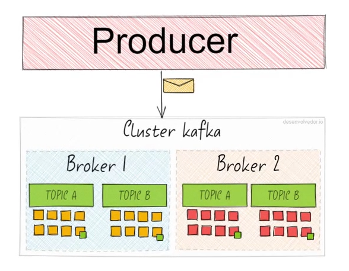

Sendo assim, a principal responsabilidade do produtor é **garantir que a mensagem chegue ao tópico corretamente**. Essa comunicação é feita por meio de bibliotecas cliente disponíveis em diversas linguagens de programação, que abstraem os detalhes de conexão, envio e confirmação das mensagens.

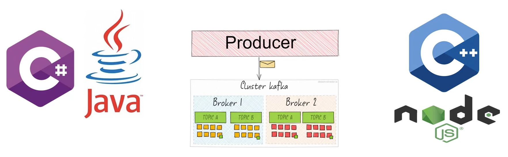

#### 👉 Resumo
- Quem envia mensagens
- Ex: API, sistema de pagamento, sensores

### 2️⃣ Consumer (Consumidor)
O **consumidor** é o responsável por **ler as mensagens** de um tópico ou vários tópicos no **Apache Kafka**.

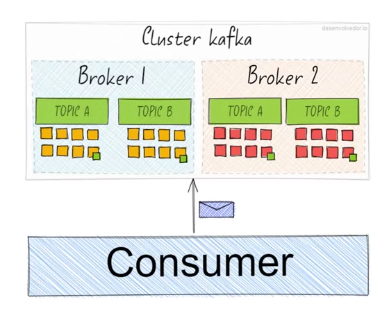

Diferente de outras arquiteturas de mensageria mais tradicionais, o Apache Kafka não trabalha com o modelo clássico de **push baseado em subscribe**, onde o broker notifica automaticamente os consumidores quando uma nova mensagem chega. No Kafka, o modelo é **pull**: ou seja, é **o próprio consumidor que vai até o broker buscar novas mensagens**.

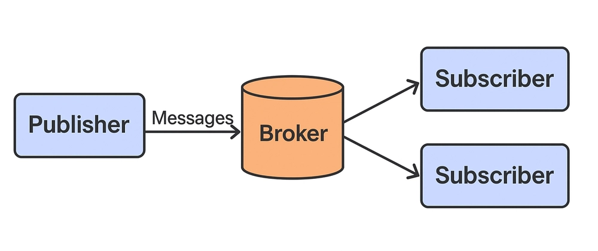

Na prática, isso significa que você precisa implementar uma lógica de leitura contínua, geralmente um **loop de consumo**, para consultar o tópico periodicamente e processar as mensagens disponíveis. Esse modelo dá mais controle ao consumidor, permitindo que ele leia no seu próprio ritmo, pause, retome ou até reprocesse mensagens.

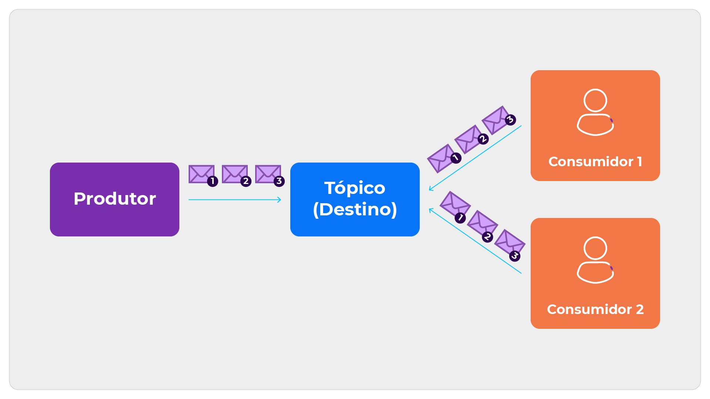

Quando o consumidor recebe uma mensagem, ela vem acompanhada de metadados importantes, como:

- **Partição →** indica de qual “fila paralela” aquela mensagem veio
- **Offset →** indica a posição exata da mensagem dentro da partição

Essas informações são essenciais para controle de processamento, pois permitem ao consumidor saber exatamente onde está na leitura e garantir consistência no consumo dos dados.

#### 👉 Resumo
- Quem lê/processa mensagens
- Pode haver vários consumidores lendo o mesmo dado

### 3️⃣ Topic

Um **tópico** basicamente é uma forma de gerenciar um grupo de mensagens dentro do **Apache Kafka**, dessa forma a gente sabe onde devemos publicar uma mensagem e de onde é possível consumir também.

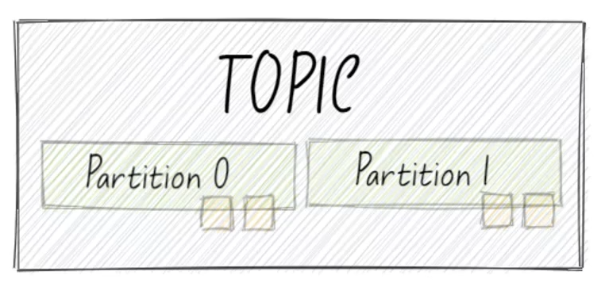

Imagine o Apache Kafka como um grande **condomínio**.

Esse condomínio tem **vários blocos de apartamentos**, e cada bloco representa um **tópico (topic)**.

#### 📌 Exemplo
- **Bloco A →** pedidos
- **Bloco B →** pagamentos
- **Bloco C →** envios

👉 Cada bloco (tópico) organiza um tipo específico de informação.

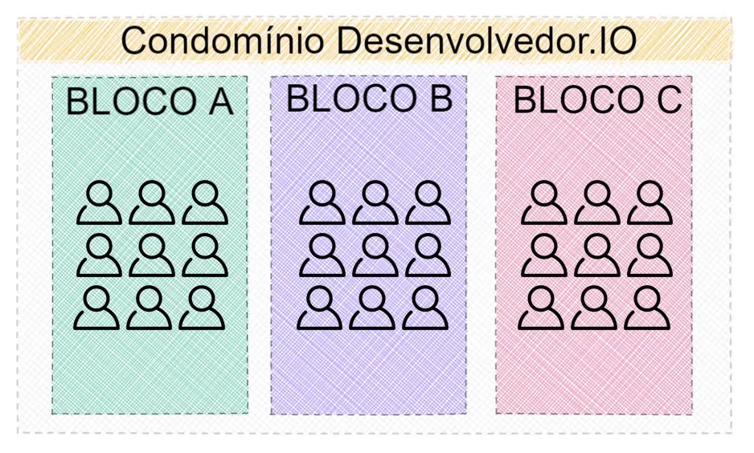


### 4️⃣ Partition
Cada tópico é formado pelo menos uma **partição** podendo existir **N** partições.

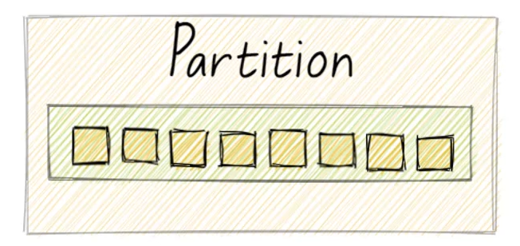

Voltando a nossa analogia do condomínio, se cada bloco representa um tópico, cada **andar** de cada bloco representa uma **partição** e é nas partições que as **mensagens são armazenadas**.

#### 📌 Exemplo:
Imagine duas famílias chegando a um condomínio 🏢: uma quer ir para o apartamento 600, no 6º andar, e a outra para o apartamento 1000, no 10º andar.

- Se existir apenas **um elevador**, a segunda família precisa esperar a primeira subir e o elevador ficar disponível novamente → tudo acontece de forma **sequencial** ⏳
- Se existirem **dois elevadores**, as duas famílias podem subir ao mesmo tempo → temos **paralelismo** 🚀

No **Apache Kafka**, essa analogia representa o papel das partições:

- **1 partição (1 elevador) →** processamento sequencial
- **Várias partições (vários elevadores) →** processamento paralelo

Isso explica por que o Kafka é tão eficiente em cenários de alto volume de dados:

- Permite maior **concorrência**
- Aumenta a **escalabilidade**
- Melhora a **performance** tanto na produção quanto no consumo de mensagens

Em resumo, as partições funcionam como múltiplos elevadores em um prédio: quanto mais elevadores disponíveis, mais pessoas conseguem se movimentar ao mesmo tempo, evitando filas e gargalos ⚡

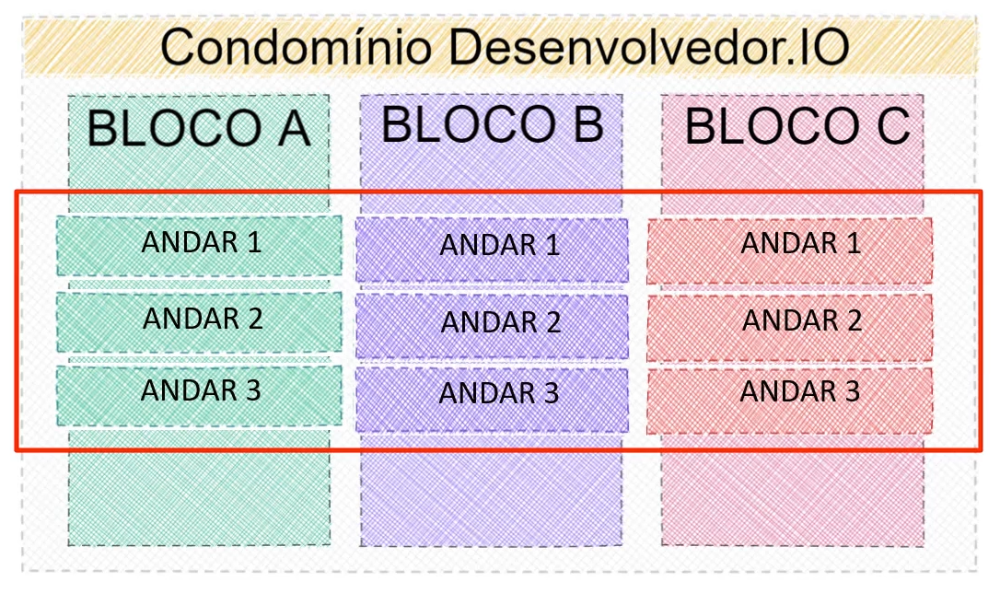

### 5️⃣ Offset
Todas as mensagens que chegam no Apache Kafka são armazenadas em uma partição, mas dentro da partição existem os **offsets** que é a **posição da mensagem armazenada fisicamente**.

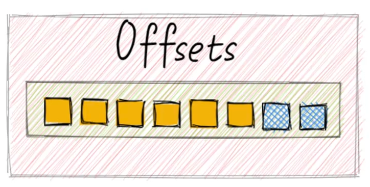

#### 📌 Exemplo:
Continuando com a analogia do condomínio para entender os **componentes do Apache Kafka**, imagine que cada **apartamento numerado em um andar** representa um **offset**. Esse apartamento guarda uma “encomenda”, ou seja, a mensagem, que contém informações como **timestamp, conteúdo, headers e sua posição dentro da sequência**.

- O número do apartamento (offset) funciona como um **marcador de posição**, indicando exatamente onde aquela mensagem está dentro da partição.
- Para o consumidor, esse número atua como um **ponteiro**, mostrando qual foi a última mensagem lida e qual será a próxima
- Assim como os apartamentos seguem uma numeração crescente, as mensagens dentro do Kafka são **armazenadas de forma sequencial** dentro de cada partição

Na prática, isso significa que o consumidor não “remove” a mensagem ao ler; ele apenas avança seu **ponteiro (offset)**, podendo inclusive voltar e reler mensagens anteriores se necessário, como alguém que decide revisitar apartamentos já percorridos.

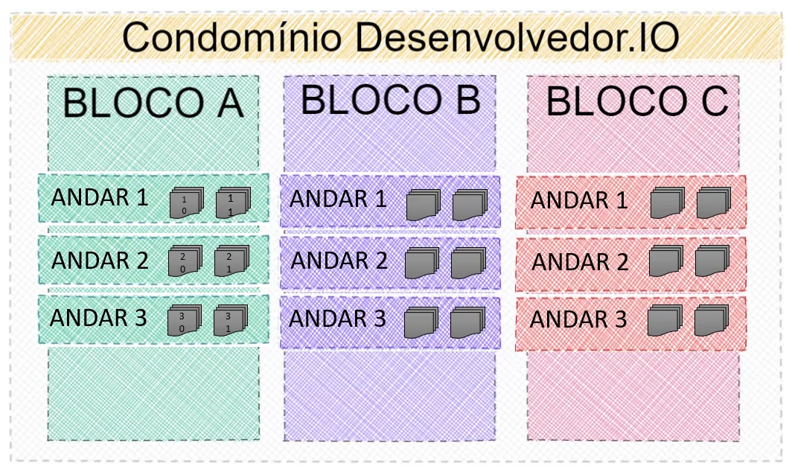

#### 👉 Resumo
- Posição da leitura dentro da partição
- Permite:
    - continuar de onde parou
    - reler dados antigos

#### 🙅 Entendimento
Para fechar o entendimento do que é um **tópico no Apache Kafka**, pense no condomínio como um todo e como cada parte se conecta 🏢:

- Cada **bloco** do condomínio representa um tópico.
- Cada **andar** dentro do bloco representa uma **partição**.
- Cada **apartamento numerado** representa um **offset ordenado**, onde as mensagens ficam **registradas de forma sequencial**.

#### Ou seja: 
- o tópico **organiza** os dados (bloco).
- as **partições** permitem o **paralelismo** (andares) 
- e os **offsets** garantem a **ordem e o controle** de leitura das mensagens (apartamentos).

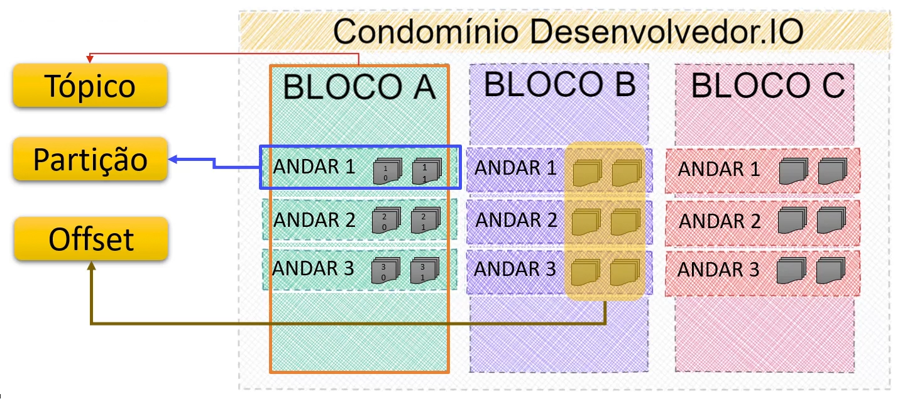

### 6️⃣ Broker
Um **broker** é basicamente um **servidor Kafka**.

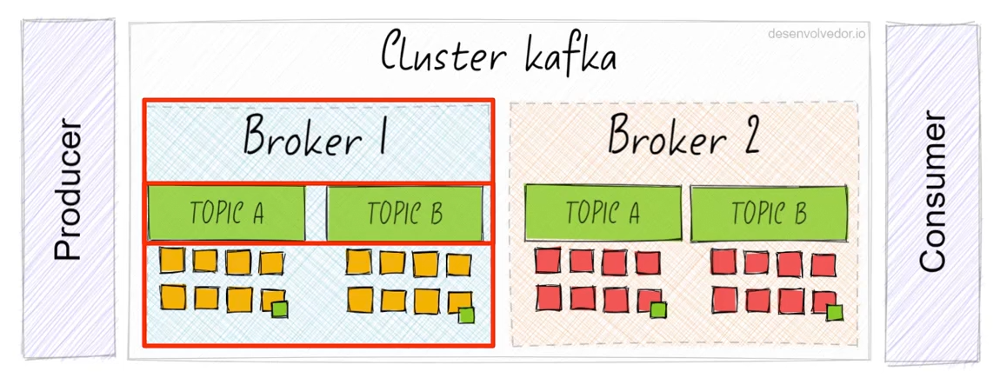

#### 👉 Pense nele como um “prédio” dentro do seu condomínio:
- Armazena dados (mensagens) em disco 💾
- Recebe mensagens dos producers 📤
- Entrega mensagens para os consumers 📥
- Mantém partições de tópicos

#### 📌 Na prática:
- Cada broker tem um ID único
- Ele guarda **partições de vários tópicos**
- Pode ser **líder ou seguidor (follower)** de uma partição

#### 👑 Líder vs Seguidor (Follower)

Para cada partição:

- **1 broker é líder**
    - Recebe escrita (producer)
    - Atende leitura (consumer, na maioria dos casos)
**Outros brokers são seguidores**
    - Mantêm cópias sincronizadas (replicação)

👉 Isso garante **alta disponibilidade**

#### 👉 Resumo
- Servidor Kafka que armazena dados
- Um cluster Kafka tem vários brokers

### 7️⃣ Cluster
Um **cluster Kafka** é o **conjunto de vários brokers trabalhando juntos**.

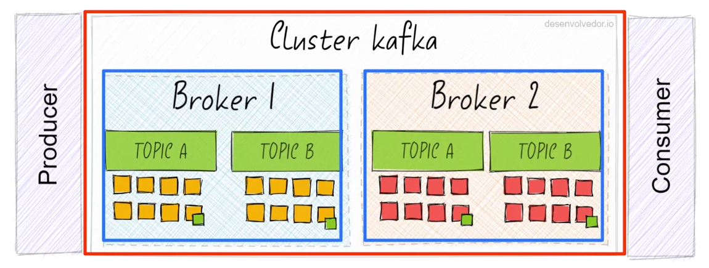

#### 🏢 Datacenter
Um **cluster do Apache Kafka** normalmente está associado a um único datacenter, onde vários brokers trabalham juntos para armazenar e distribuir os dados. No entanto, é possível configurar **replicação entre múltiplos datacenters** (multi-cluster ou geo-replicação), permitindo que as mensagens sejam copiadas entre diferentes regiões.

Com isso, você eleva significativamente:
- **Disponibilidade 🟢 →** se um datacenter inteiro falhar, outro pode assumir.
- **Resiliência 🛡️ →** maior tolerância a falhas catastróficas.=
- **Escalabilidade geográfica 🌎 →** sistemas distribuídos globalmente.

Na prática, isso permite construir aplicações mais robustas e preparadas para cenários de alta demanda e falhas em larga escala.

#### 👉 Voltando à analogia:
- **Broker →** prédio
- **Cluster →** o condomínio inteiro

#### 🎯 Papel do Cluster

O cluster é responsável por:
- Distribuir dados entre brokers
- Garantir escalabilidade horizontal 📈
- Garantir tolerância a falhas 🛡️
- Gerenciar replicação

#### 👉 Resumo
- Conjunto de brokers trabalhando juntos
- Garante alta disponibilidade

### 8️⃣ Consumer Group
Quando você sobe uma instância de consumidor no Apache Kafka, pode informar a qual **consumer group** ela pertence. Esse grupo funciona como um time: todos os consumidores que fazem parte dele **dividem o trabalho de ler as mensagens de um tópico**.

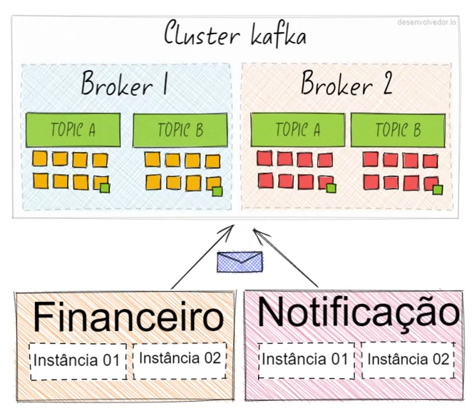

Quando existem vários consumidores dentro do mesmo grupo, o Kafka faz automaticamente um **balanceamento das partições** entre essas instâncias. Ou seja, a carga de leitura é distribuída para que o processamento aconteça em paralelo e de forma mais eficiente

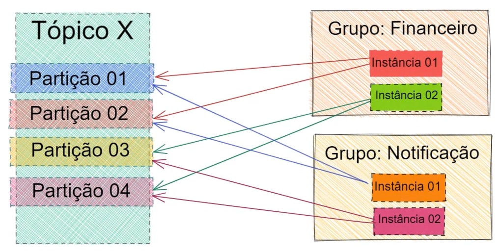

#### 📌 Exemplo:
Agora, olhando alguns cenários práticos:

#### 1️⃣ Cenário 1
Imagine um grupo chamado **financeiro** com **4 instâncias de consumidores**, mas o tópico possui apenas **3 partições**. Nesse caso:

- **Instância 1 →** consome da partição 1
- **Instância 2 →** consome da partição 2
- **Instância 3 →** consome da partição 3
- **Instância 4 →** fica ociosa

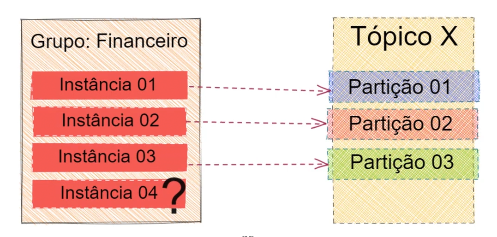

Isso acontece porque, dentro de um mesmo grupo, **cada partição só pode ser consumida por uma única instância por vez**. Como já não há mais partições disponíveis, a quarta instância fica parada até que alguma partição seja liberada (por exemplo, se outra instância cair ou reiniciar, algo comum em ambientes como Kubernetes).

#### 2️⃣ Cenário 2

Agora o cenário inverso: você tem **menos instâncias do que partições**. Por exemplo, 2 consumidores e 3 partições:

- **Instância 1 →** consome da partição 1
- **Instância 2 →** consome das partições 2 e 3

Aqui, uma mesma instância pode consumir **mais de uma partição**, o que é totalmente válido. O que não pode acontecer é **duas instâncias do mesmo grupo consumirem a mesma partição ao mesmo tempo**, pois isso quebraria a garantia de ordem das mensagens dentro da partição.

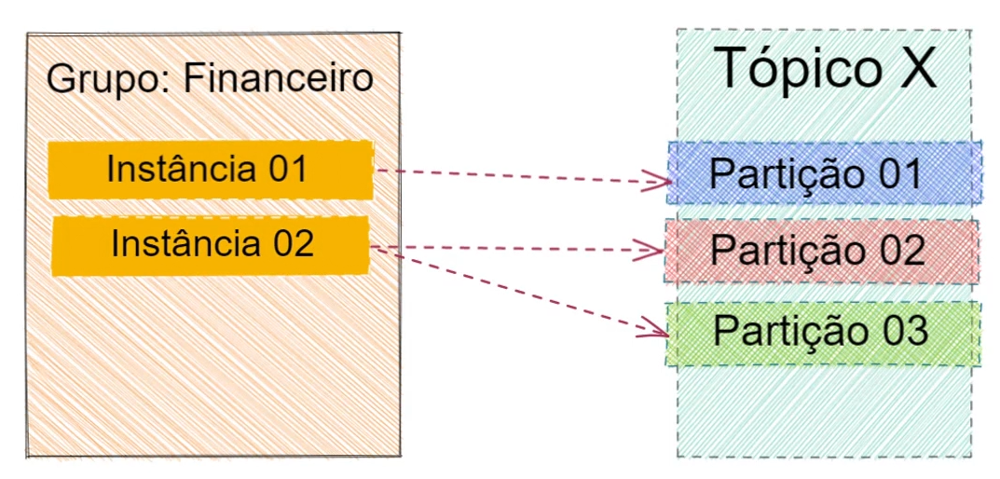

No fim das contas, os **consumer groups permitem escalar o consumo de forma controlada**: você adiciona mais instâncias para aumentar a capacidade de processamento, mas sempre **respeitando o limite imposto pelo número de partições**.

#### 👉 Resumo
- Grupo de consumidores que divide o trabalho
- Cada partição é consumida por apenas um consumidor do grupo
- Isso permite escalar processamento

### 9️⃣ ZooKeeper (legado) / KRaft (novo)
**Zookeeper** é um software desenvolvido pela Apache e funciona como um **serviço centralizado** onde **mantém as configurações e estado dos servidores**, em nosso caso de um **Cluster do Apache kafka**.

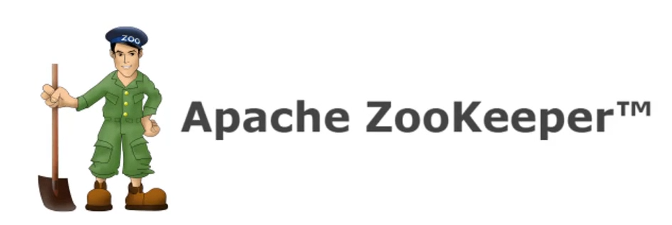

#### 📌 Exemplo:
Quando você cria um tópico no Apache Kafka, pode definir o **fator de replicação**, que determina quantas cópias dos dados existirão no cluster. Por exemplo, se você tem 2 brokers e define fator de replicação 2, cada partição do tópico terá uma cópia em cada broker.

Quando uma mensagem é publicada, ela é escrita primeiro no **broker líder** daquela partição. Esse líder é responsável por **replicar os dados para os outros brokers seguidores (followers)**, garantindo que existam cópias sincronizadas da mesma informação em diferentes servidores. Isso aumenta a **resiliência e a disponibilidade**, já que, se um broker falhar, os dados ainda estarão disponíveis em outro.

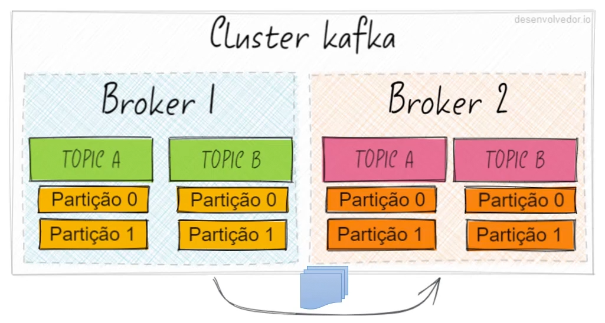

Sobre o papel do **Apache ZooKeeper**, tradicionalmente, ele atua como um sistema de **coordenação do cluster, monitorando o estado dos brokers**. Quando identifica que um broker (especialmente um líder) não está mais respondendo, ele coordena a **eleição de um novo líder** para aquela partição, garantindo que o sistema continue funcionando sem interrupção.

Vale observar que, nas versões mais recentes do Kafka, o ZooKeeper está sendo substituído pelo modo **KRaft**, que elimina essa dependência externa e incorpora a gestão de metadata diretamente no próprio Kafka.

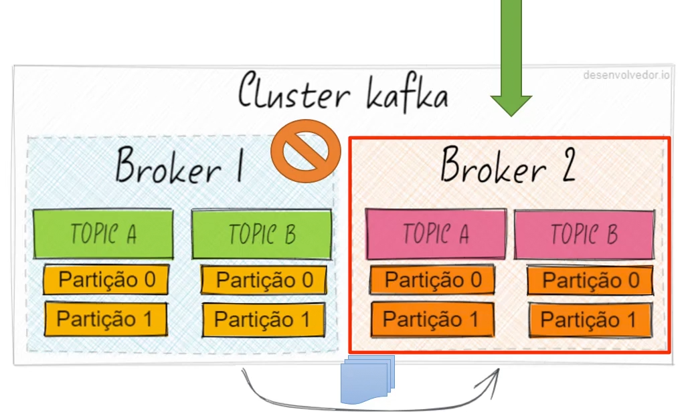

#### 🖧 KIP-500
**KIP-500** é um conjunto de propostas para a retirada do ZooKeeper e a criação de um novo Quórum do controlador, no qual os nós sejam capazes de conversar entre si e eleger um líder controlador.

Basicamente esse novo líder controlador vai armazenar as configurações que basicamente o zookeeper armazenava do cluster.

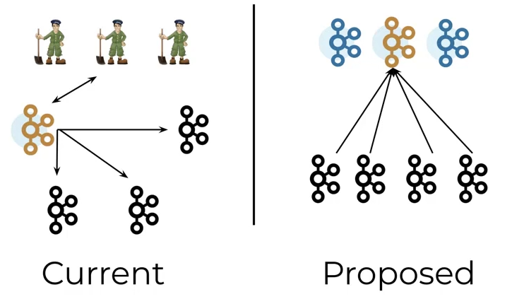

#### 👉 Resumo
- Gerencia o cluster (eleições, metadata)
- Hoje o Kafka está migrando para o modo KRaft (sem ZooKeeper)

## ⚔️ Kafka vs RabbitMQ


### 🔄 Reprocessamento
- **Kafka**
    - Mantém as mensagens por um tempo configurável
    - Permite reler eventos antigos a qualquer momento
    - Ideal para auditoria, replay e reconstrução de estado
- **RabbitMQ**
    - m normalmente é removida após consumo
    - ssamento exige estratégias extras (dead letter, requeue, etc.)

👉 Kafka ganha com folga aqui

### ⚡ Throughput (volume de dados)
- **Kafka**
    - Altíssimo throughput (milhões de mensagens/segundo)
    - Projetado para big data e streaming
- **RabbitMQ**
    - Bom throughput, mas menor que Kafka
    - Melhor para cargas moderadas e controle fino

👉 Kafka é mais indicado para alto volume

### 🌊 Streaming de dados
- **Kafka**
    - Nativo para streaming
    - Trabalha como um log de eventos contínuo
    - Integra com processamento em tempo real
- **RabbitMQ**
    - Não é focado em streaming
    - Modelo baseado em fila tradicional

👉 Kafka é feito para isso

### 🧠 Modelo de consumo
- **Kafka (pull)**
    - Consumidor busca mensagens
    - Mais controle sobre ritmo e reprocessamento
- **RabbitMQ (push)**
    - Broker envia mensagens para consumidores
    - Menor latência em cenários simples

### 🧾 Garantia de entrega
- **Kafka**
    - At-least-once (padrão)
    - Exactly-once (mais avançado, com configuração)
- **RabbitMQ**
    - At-least-once
    - Pode configurar ack manual

👉 Ambos são confiáveis, mas Kafka é mais forte em consistência distribuída

### 🧩 Ordenação
- **Kafka**
    - Garantida dentro da partição
- **RabbitMQ**
    - Pode manter ordem na fila, mas com paralelismo isso pode se perder

### 🏗️ Arquitetura
- **Kafka**
    - Log distribuído
    - Baseado em partições
    - Altamente escalável horizontalmente
- **RabbitMQ**
    - Baseado em filas e exchanges
    - Mais flexível em roteamento (routing keys, fanout, topic exchange)

👉 RabbitMQ ganha em flexibilidade de roteamento

### 🧠 Complexidade
- **Kafka**
    - Mais complexo de operar
    - Exige entendimento de partições, offsets, retenção
- **RabbitMQ**
    - Mais simples de começar
    - Curva de aprendizado menor

### 🏆 Reputação / uso no mercado
- **Kafka**
    - Muito usado em:
        - Big techs
        - Data engineering
        - Event-driven architectures
        - Forte em cenários de escala massiva
- **RabbitMQ**
    - Muito usado em:
        - Sistemas corporativos
        - Integrações tradicionais
        - Microservices mais simples

👉 Ambos são maduros e amplamente usados

### ⏱️ Latência
- **Kafka**
    - Levemente maior (batch + pull)
- **RabbitMQ**
    - Menor latência (push direto)

👉 RabbitMQ pode ser melhor para respostas rápidas

### 📦 Persistência
- **Kafka**
    - Persistência forte por padrão
- **RabbitMQ**
    - Persistência opcional (pode ser configurada)

### 🧠 Quando usar cada um
#### Use Kafka quando:
- Precisa de streaming de dados
- Alto volume (big data)
- Quer reprocessamento
- Arquitetura orientada a eventos
- Analytics em tempo real

#### Use RabbitMQ quando:
- Precisa de roteamento complexo
- Comunicação entre serviços (fila clássica)
- Baixa latência
- Simplicidade operacional
- Work queues (tarefas assíncronas)

#### 🎯 Resumo direto
- **Kafka →** log distribuído + streaming + escala massiva
- **RabbitMQ →** filas + roteamento + simplicidade

| Critério                | Kafka 🟢                        | RabbitMQ 🔵                        | 🏆 Melhor         |
| ----------------------- | ------------------------------- | ---------------------------------- | ----------------- |
| **Modelo**              | Log distribuído 📜              | Filas tradicionais 📬              | Depende do uso 🤝 |
| **Reprocessamento**     | Nativo via offset 🔄            | Limitado (requeue/DLQ) ♻️          | Kafka 🟢          |
| **Throughput**          | Muito alto ⚡                    | Médio a alto 🚀                    | Kafka 🟢          |
| **Streaming**           | Nativo 🌊                       | Não é foco 🚫                      | Kafka 🟢          |
| **Modelo de consumo**   | Pull (controle do consumer) 🎯  | Push (simplicidade) 📤             | Depende 🤝        |
| **Garantia de entrega** | At-least / Exactly once ✅       | At-least once ☑️                   | Kafka 🟢          |
| **Ordenação**           | Garantida na partição 📏        | Pode se perder com concorrência ⚠️ | Kafka 🟢          |
| **Escalabilidade**      | Alta (partições) 📈             | Limitada ⚖️                        | Kafka 🟢          |
| **Latência**            | Maior (batch/pull) ⏳            | Baixa ⚡                            | RabbitMQ 🔵       |
| **Persistência**        | Forte por padrão 💾             | Opcional ⚙️                        | Kafka 🟢          |
| **Roteamento**          | Simples 🔀                      | Muito flexível (exchanges) 🧠      | RabbitMQ 🔵       |
| **Complexidade**        | Mais complexo 🧩                | Mais simples 🙂                    | RabbitMQ 🔵       |
| **Uso típico**          | Streaming, eventos, big data 📊 | Filas, tarefas assíncronas 📦      | Depende 🤝        |
| **Reputação**           | Forte em data/streaming 🏢      | Forte em sistemas corporativos 🏬  | Empate 🤝         |


### 🔥 Diferenciais do Kafka
- Alta performance
- Escalável horizontalmente
- Persistência de dados
- Reprocessamento
- Baseado em log (não só fila)

### 💼 Casos de uso comuns
- Microservices
- Event-driven architecture
- Logs centralizados
- Streaming de dados (analytics em tempo real)
- Integração entre sistemas legados

## ⛃ Schema Registry
O **Schema Registry** tem como objetivo fornecer uma API RESTful para gerenciar e versionar esquemas no formato Avro, JSON Schema e Protobuf para um tópico.

Todas as informações (metadados) do Schema são armazenados em um tópico do própio Apache Kafka.

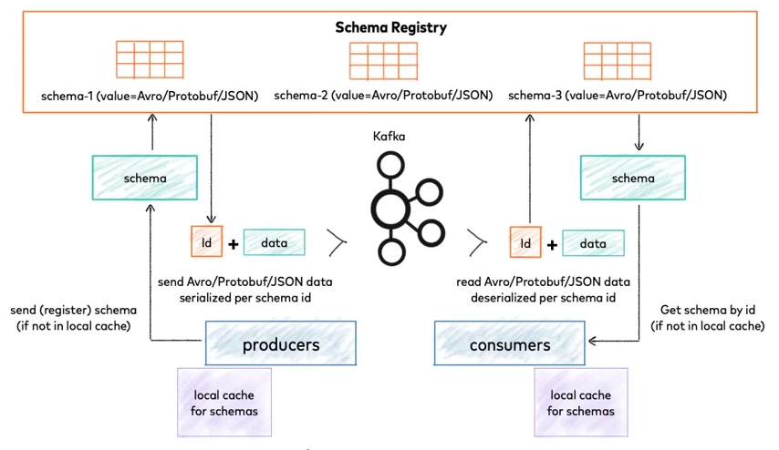

### ✨ Qual o problema ele resolve?
Imagine um cenário com dois times: um responsável pelo **producer** e outro pelo **consumer**. Nem sempre ambos trabalham com o mesmo entendimento do formato dos dados, o que pode gerar inconsistências e erros na comunicação.

É nesse ponto que entra o **Schema Registry**. Ele atua como uma camada de governança, garantindo que produtores e consumidores sigam contratos bem definidos (schemas) ao publicar e ler mensagens em um tópico do Apache Kafka.

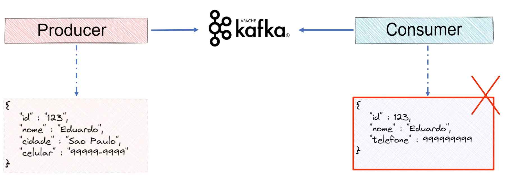

#### 🔷 Producer

Com o uso do Schema Registry, o comportamento do produtor muda:

- Ao enviar uma mensagem pela primeira vez, ele registra o schema no Schema Registry.
- O serviço retorna um ID único para esse schema.
- Esse ID é armazenado em cache local para evitar chamadas repetidas, melhorando a performance.
- Nas próximas mensagens, o producer envia apenas:
    - o **ID do schema**
    - o **payload serializado**

👉 Ou seja, não é necessário enviar o schema completo a cada mensagem, reduzindo o tamanho e aumentando a eficiência.

#### 🔷 Consumer
- O consumer consulta o Schema Registry para obter os schemas (e suas versões) associados ao tópico.
- Ao ler uma mensagem do Kafka, ele utiliza o ID do schema presente na mensagem para identificar corretamente o formato.
- Com isso, consegue fazer a desserialização precisa, respeitando versão e estrutura dos dados.

#### ✅ Benefícios
- Garantia de compatibilidade entre producer e consumer
- Versionamento de schemas
- Redução de erros de integração
- Melhor performance (uso de cache + envio de ID ao invés do schema completo)
- Evolução segura dos contratos de dados

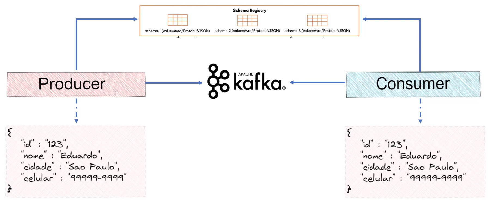

### 🎯 Resumo
O Schema Registry funciona como um “contrato centralizado” entre sistemas, garantindo que diferentes times consigam evoluir suas aplicações sem quebrar a comunicação baseada em eventos.

## 🤝🏼 Acknowledgements
**Acknowledgements**, basicamente é quanto o Kafka precisa **confirmar antes de dizer “ok, mensagem recebida”** para o producer.

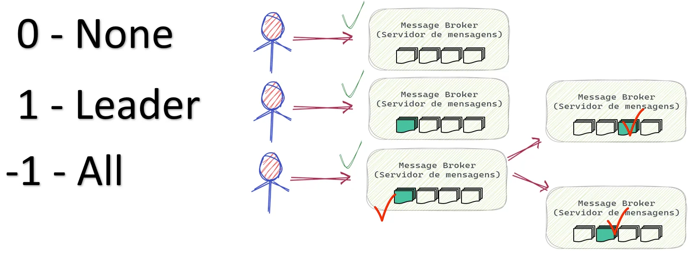

### 🥇 Tipos de acks
#### 🔷 None (acks=0)

👉 O producer não espera nenhuma confirmação

#### ✔️ Vantagens
- ultra rápido ⚡
- menor latência

#### ❌ Desvantagens
- pode perder mensagem 😬
- sem garantia nenhuma

#### 📌 Quando usar
- logs
- métricas não críticas

#### 🔷 Leader (acks=1)

👉 O leader da partição confirma quando recebe

#### ✔️ Vantagens
- bom equilíbrio
- latência baixa

#### ❌ Desvantagens
- se o leader cair antes de replicar → perde mensagem

#### 📌 Quando usar
- maioria dos casos padrão

#### 🔷 All (acks=all ou -1)

👉 Espera todas as réplicas sincronizadas (ISR) confirmarem

#### ✔️ Vantagens
- máxima confiabilidade 💎
- evita perda de dados

#### ❌ Desvantagens
- mais lento
- depende de replicas saudáveis

#### 📌 Quando usar
- pagamentos 💳
- pedidos
- sistemas críticos

### 🔥 Exemplo visual
```bash
acks=1
Producer → Leader ✔️ → responde (mesmo sem replicar)

acks=all
Producer → Leader → Replica1 ✔️ → Replica2 ✔️ → responde
```

## 0️⃣ Auto Offset Reset

**Auto Offset Reset** define **o que o consumer faz quando NÃO existe offset salvo** para aquele grupo.

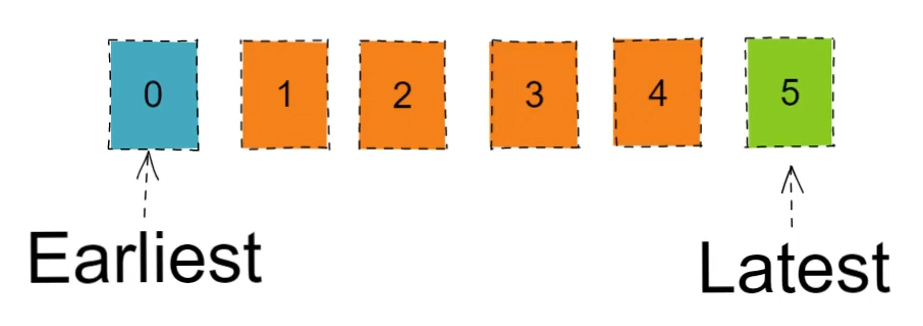

### 🧠 O que é offset mesmo?
- Cada mensagem no Kafka tem um número (offset) 📍
- O consumer guarda “até onde já leu”

👉 Esse controle é por consumer group

🔑 O papel do `auto.offse.reset`

#### Ele só entra em ação quando:

- ❌ o consumer nunca leu esse tópico antes
- ❌ ou o offset salvo foi apagado/expirou

👉 Ou seja: **não é usado sempre!**

### 🥇 Opções disponíveis

#### ⏪ earliest

👉 Começa do início do tópico

#### ✔️ Comportamento
- lê TODAS as mensagens antigas
- depois continua com as novas

#### 📌 Quando usar
- replay de eventos 🔁
- debug 🐛
- novos serviços lendo histórico

#### ⏩ latest (default)

👉 Começa só das novas mensagens

#### ✔️ Comportamento
- ignora tudo que já existe
- só lê o que chegar depois

#### 📌 Quando usar
- sistemas em tempo real
- não precisa de histórico

#### 🚫 none

👉 Se não houver offset → erro

#### ✔️ Comportamento
- falha imediatamente

#### 📌 Quando usar
- quando você quer controle total
- evitar consumo acidental

## 🔢 Ordem das Mensagens
O Apache Kafka **garante ordem apenas dentro de uma partição**.

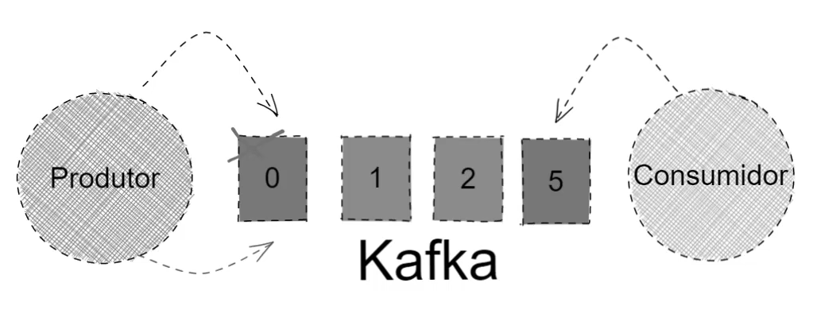

### 🔑 Como funciona a ordem

#### Cada tópico é dividido em partições:
```bash
Topic: Orders

Partition 0 → msg1 → msg2 → msg3
Partition 1 → msgA → msgB → msgC
```
✔️ Dentro da mesma partição: ordem garantida \
❌ Entre partições diferentes: ordem NÃO é garantida

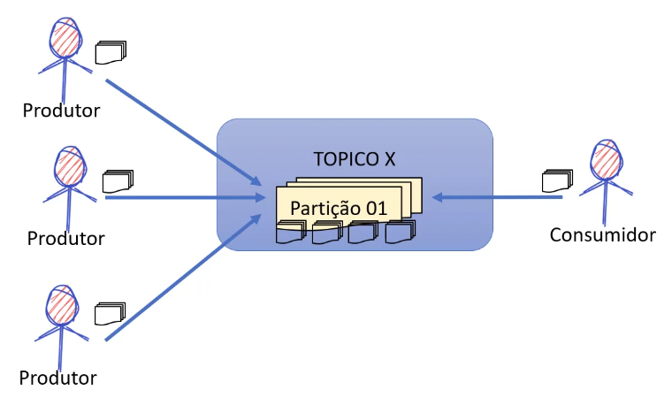

#### 🥇 Exemplo prático

#### Você envia:
```bash
OrderCreated (id=1)
OrderPaid (id=1)
OrderShipped (id=1)
```

#### 👉 Se cair na MESMA partição:
```bash
✔️ ordem preservada
Created → Paid → Shipped
```

#### 👉 Se cair em partições diferentes:
```bash
❌ pode acontecer:
Paid → Created → Shipped 😬
```

### 🎯 Como garantir ordem corretamente

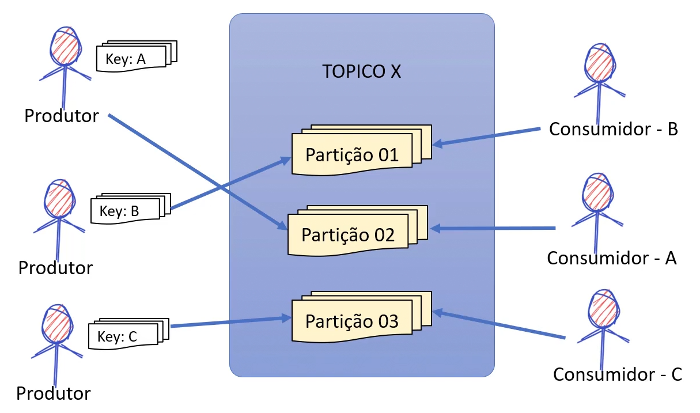

#### 🥇 Usar key (ESSENCIAL)

Kafka usa a key para decidir a partição.
```csharp
await producer.ProduceAsync("orders", new Message<string, string>
{
    Key = "order-1",
    Value = "OrderPaid"
});
```

#### 👉 Todas mensagens com mesma key:
```bash
"order-1" → mesma partição → ordem garantida ✔️
```
#### 🧠 Estratégia de key
| Caso      | Key        |
| --------- | ---------- |
| pedidos   | orderId    |
| cliente   | customerId |
| pagamento | paymentId  |


## 🔂 Idempotência

**Idempotência** significa que uma mesma **operação pode ser executada várias vezes sem alterar o resultado final além da primeira execução**, ou seja, é um recurso para **evitar processamento de solicitações repetidas**.


#### 👉 No contexto do Kafka:

Um **producer idempotente** garante que **uma mensagem não será gravada mais de uma vez no tópico**, mesmo em caso de retry.

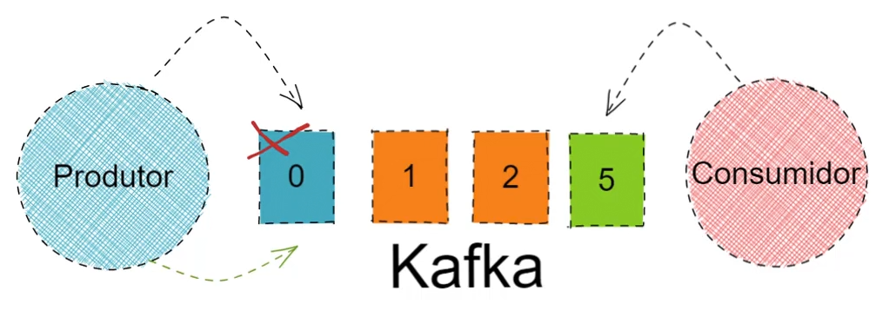

### 💥 O problema sem idempotência

#### Sem idempotência, pode acontecer isso:

1. Producer envia mensagem 📤
1. Broker recebe 👍
1. ACK se perde (timeout/rede) ❌
1. Producer tenta novamente (retry) 🔁
1. Resultado: mensagem duplicada no tópico 😬

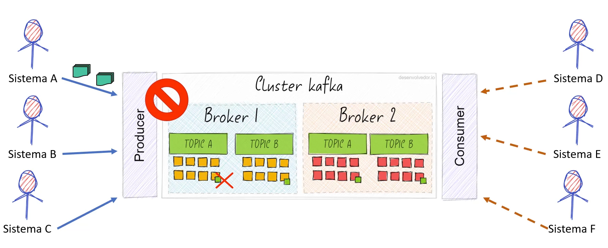

### ✅ Como a idempotência resolve

#### Quando você habilita idempotência:
- O Kafka atribui um Producer ID (PID) único
- Cada mensagem recebe um sequence number
- O broker detecta duplicatas e ignora mensagens repetidas

**Resultado:** exactly-once por partição (no producer) 🔒

### ⚙️ Como habilitar idempotência
#### 🔷 Configuração básica

No producer:
```properties
enable.idempotence=true
```

#### 🔷 Em C# (Confluent.Kafka)
```csharp
var config = new ProducerConfig
{
    BootstrapServers = "localhost:9092",
    EnableIdempotence = true
};
```

### ⚠️ Requisitos importantes

Quando você ativa `enable.idempotence=true`, o Kafka automaticamente ajusta (ou exige):
| Configuração                            | Valor esperado             |
| --------------------------------------- | -------------------------- |
| `acks`                                  | `all`                      |
| `retries`                               | > 0 (normalmente infinito) |
| `max.in.flight.requests.per.connection` | ≤ 5                        |

👉 Em versões mais novas, isso já vem automático.


## 💱 Transações
**Transações** permitem que você trate **um conjunto de mensagens como uma única operação atômica**. Se algo falhar no meio, **nada é visível para os consumidores**. Se tudo der certo, tudo aparece junto. Sem meio-termo.

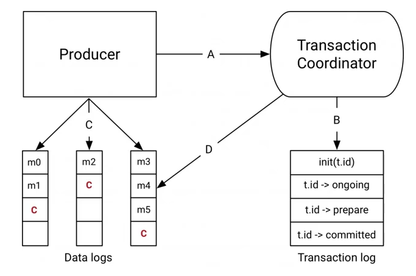

### 🧠 O que são transações no Kafka?

#### Com transações você consegue:

- ✅ Publicar mensagens em vários tópicos
- ✅ Garantir que ou todas são gravadas ou nenhuma é
- ✅ Sincronizar consume + produce (read-process-write)
- ✅ Evitar duplicidade + inconsistência

### 💥 Problema que transações resolvem

#### Imagine seu fluxo:

1. Consome OrderCreated
1. Processa
1. Publica:
    - OrderPaid
    - OrderLoweredStock

#### Agora pense num erro:
- Publicou OrderPaid ✅
- Falhou antes de OrderLoweredStock ❌

👉 **Resultado:** sistema inconsistente 😬

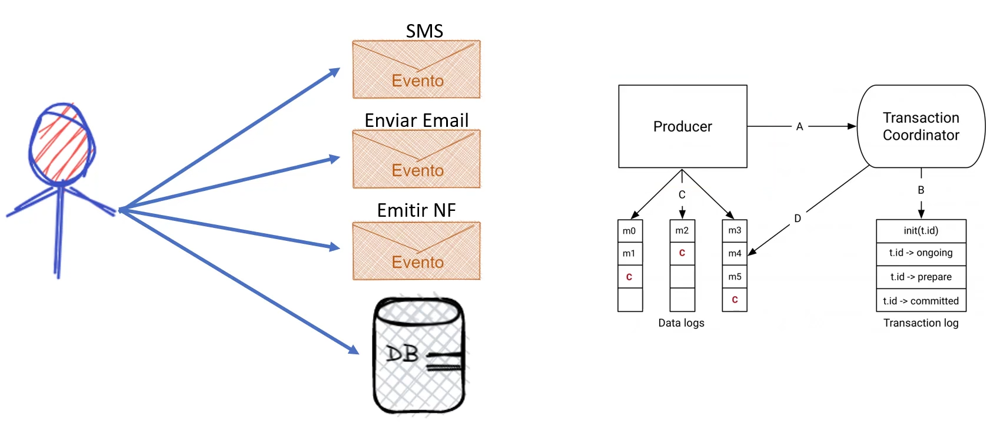

### ✅ Com transações

Tudo acontece dentro de uma transação:
- Se tudo der certo → **commit**
- Se falhar → **abort**

👉 Resultado:
- Ou aparecem as duas mensagens
- Ou nenhuma aparece

### ⚙️ Como funciona por baixo dos panos

#### Kafka usa:
- Producer com ID transacional (transactional.id)
- Controle de estado no broker
- Marcação de mensagens como committed ou aborted
- Consumers configurados corretamente **só enxergam mensagens commitadas**

## 🔳 Comandos Básicos

### 📌 Criar um tópico

Cria um novo tópico chamado `cursos`.
```bash
sh kafka-topics.sh --create --topic cursos --bootstrap-server localhost:9094
```

### 📌 Listar tópicos

Lista todos os tópicos existentes no cluster.
```bash
sh kafka-topics.sh --list --bootstrap-server localhost:9094,localhost:9095
```

### 📌 Excluir tópico

Remove um tópico existente.
```bash
sh kafka-topics.sh --delete --topic cursos --bootstrap-server localhost:9094
```

### 📌 Criar tópico com múltiplas partições

Cria um tópico chamado `chat` com:

- 2 partições
- fator de replicação 2

```bash
sh kafka-topics.sh --create \
--topic chat \
--bootstrap-server localhost:9094 \
--partitions 2 \
--replication-factor 2
```

#### 🧠 Explicando
| Parâmetro            | Descrição               |
| -------------------- | ----------------------- |
| --partitions         | Quantidade de partições |
| --replication-factor | Quantidade de réplicas  |

### 📌 Alterar quantidade de partições

Aumenta o número de partições do tópico.
```bash
sh kafka-topics.sh --alter \
--topic chat \
--bootstrap-server localhost:9094 \
--partitions 3
```

### 📌 Obter detalhes de um tópico

Mostra informações completas do tópico.
```bash
sh kafka-topics.sh --describe \
--topic chat \
--bootstrap-server localhost:9094
```

#### 🔍 Informações exibidas
- Partições
- Líderes
- Réplicas
- ISR (In-Sync Replicas)
- Configurações

### 📌 Gerar um UUID para o Cluster

Gera um identificador único do cluster Kafka.
```bash
sh kafka-storage.sh random-uuid
```

#### 🧠 Exemplo de saída
```bash
4cN1snN6QXGYMJTIJ-rX5Q
```

Esse UUID será utilizado na formatação do storage do broker.

### 📌 Formatar o Storage do Kafka

Inicializa e formata os diretórios de armazenamento do broker.
```bash
sh kafka-storage.sh format \
-t 4cN1snN6QXGYMJTIJ-rX5Q \
-c ../config/server.properties \
--standalone
```

#### 🧠 Explicando os parâmetros
| Parâmetro    | Descrição                         |
| ------------ | --------------------------------- |
| -t           | UUID do cluster                   |
| -c           | Arquivo de configuração do broker |
| --standalone | Executa em modo standalone        |

#### ⚠️ Importante

A formatação:
- cria os metadados internos do cluster
- inicializa os logs do Kafka
- prepara o broker para execução

> ⚠️ Esse processo normalmente é executado apenas uma vez.

### 📌 Iniciar o Broker Kafka

Inicia o servidor Kafka utilizando o arquivo de configuração informado.

```bash
sh kafka-server-start.sh config/server.properties
```

#### 🧠 O que acontece ao iniciar?

O broker:
- sobe na porta configurada
- carrega tópicos e metadados
- inicia comunicação com outros brokers
- fica pronto para receber producers e consumers

### 📌 Fluxo Completo de Inicialização
```bash
1. Gerar UUID
        ↓
2. Formatar Storage
        ↓
3. Iniciar Broker Kafka
```

### 📨 Produzir mensagens

Inicia um producer via terminal.
```bash
sh kafka-console-producer.sh \
--topic chat \
--bootstrap-server localhost:9094
```
Após executar:
```bash
Olá Kafka
Mensagem 2
Mensagem 3
```
Cada linha será enviada como uma mensagem.

### 📥 Consumir mensagens

Consome mensagens do tópico.
```bash
sh kafka-console-consumer.sh \
--topic chat \
--bootstrap-server localhost:9094 \
--from-beginning \
--property print.partition=true \
--property print.offset=true
```

#### 🧠 Explicando parâmetros
| Parâmetro        | Descrição                   |
| ---------------- | --------------------------- |
| --from-beginning | Lê mensagens desde o início |
| print.partition  | Mostra partição             |
| print.offset     | Mostra offset               |

### 👥 Consumir mensagens usando Consumer Groups

Executa consumo em grupo.
```bash
sh kafka-console-consumer.sh \
--topic chat \
--bootstrap-server localhost:9094 \
--from-beginning \
--property print.partition=true \
--property print.offset=true \
--group grupo1
```

👉 Uma partição só pode ser consumida por um consumidor do mesmo grupo.

### 💻 Integração com .NET
#### 📦 Instalar biblioteca Kafka

Instala o client oficial do Kafka para .NET:

#### Confluent.Kafka
```bash
dotnet add package Confluent.Kafka
```

#### 🧬 Trabalhando com Avro
#### 📦 Instalar ferramentas Avro
Instala a tool global para geração de classes.
```bash
dotnet tool install --global Apache.Avro.Tools
```

#### 📦 Instalar dependência Avro para .NET

Instala serialização Avro integrada ao Schema Registry.
```bash
dotnet add package Confluent.SchemaRegistry.Serdes.Avro
```

#### 📄 Gerar classes a partir do Schema

Gera classes C# utilizando arquivos `.avsc`.
```bash
avrogen -s ../Avros/Curso.avsc .
```

#### 🧠 O que é Avro?

Apache Avro é um sistema de serialização binária muito utilizado com Kafka.

#### ✅ Benefícios
- Alta performance ⚡
- Payload menor 📦
- Versionamento de schemas 🔄
- Forte tipagem 🧩

#### 📌 Exemplo de Schema Avro
```json
{
  "type": "record",
  "name": "Curso",
  "namespace": "NSE.Contracts",
  "fields": [
    {
      "name": "Id",
      "type": "string"
    },
    {
      "name": "Nome",
      "type": "string"
    }
  ]
}
```

### 🐳 Subir containers Kafka
```bash
docker compose -f docker-compose-cofluent.yml up -d
```

### 🐳 Derrubar containers Kafka
```bash
docker compose -f docker-compose-cofluent.yml down -v
```